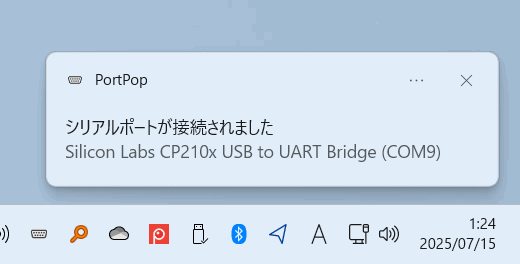
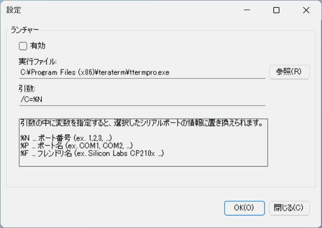

PortPop
====

USBシリアルを使っていて、新しいポートに割り当てられるたびにデバイスマネージャを開くのが面倒だったので作ってみました。

シリアルポートが着脱されたときに、ポート名をバルーン表示でお知らせします。

タスクトレイアイコンを左クリックすると、現在接続されているポートの一覧が表示されます。

ポート名のバルーン表示、または、ポート一覧をクリックすると、あらかじめ設定したプログラム(Tera Term Pro)を起動することができます。起動するプログラムには、ポート番号、ポート名、またはフレンドリ名を変数として渡すことができます。
プログラムの起動機能はデフォルトでは無効になっているので、設定画面から有効化してください。

おまけ機能で、接続されたドライブ名も表示します。(デフォルトはOFFです。設定メニューで有効にして下さい)

## Description

## Requirement

* Microsoft Windows 7 以降
* Microsoft .net Framework 4.8 以降

## Install

[PortPopInstaller.msi](https://github.com/tomozh/PortPop/raw/master/PortPopInstaller/Release/PortPopInstaller.msi?raw=true) を実行してインストール、または、[PortPop.exe](https://github.com/tomozh/PortPop/blob/master/PortPop/bin/Release/PortPop.exe?raw=true) を、適当なフォルダに入れて実行して下さい。

実行後は、タスクトレイに常駐します。

インストーラでインストールした場合は、スタートアップへ自動的に登録されます。(ログオン時に自動起動します)

## Licence

[MIT](https://opensource.org/licenses/mit-license.php)

## Author

[tomozh](http://ore-kb.net)
